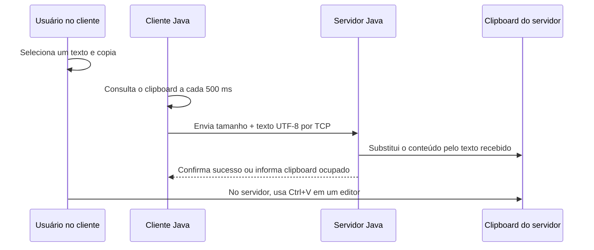

# Área de Transferência via Sockets em Java

Projeto acadêmico de Sistemas Distribuídos — **Tema 04: Envio da área de transferência (Ctrl+C)**.

O cliente acompanha mudanças no texto da sua área de transferência e envia o conteúdo automaticamente pela rede. O servidor recebe esse texto e o coloca na sua própria área de transferência, permitindo colá-lo com **Ctrl+V** em um editor.

## Sumário

- [Funcionamento](#funcionamento)
- [Arquivos](#arquivos)
- [Requisitos](#requisitos)
- [Teste em uma máquina](#teste-em-uma-máquina)
- [Teste em duas máquinas](#teste-em-duas-máquinas)
- [IP e porta](#ip-e-porta)
- [Mensagens esperadas](#mensagens-esperadas)
- [Detalhes da implementação](#detalhes-da-implementação)
- [Testes sugeridos](#testes-sugeridos)
- [Solução de problemas](#solução-de-problemas)
- [Limitações e segurança](#limitações-e-segurança)

## Funcionamento



1. O servidor começa a escutar conexões na porta TCP **9870**.
2. O cliente registra o texto que já estava no seu clipboard, sem enviá-lo, e tenta conectar ao servidor.
3. A cada aproximadamente **500 ms**, o cliente verifica se existe um texto diferente do último confirmado.
4. O cliente envia esse texto; o servidor valida a mensagem e atualiza seu clipboard.
5. O servidor responde à solicitação. O cliente só registra o texto como confirmado após receber sucesso.
6. O usuário pode colar o conteúdo no Bloco de Notas do servidor.

**Copiar e colar são ações diferentes:** copiar um novo texto provoca o envio e as mensagens nos terminais. Colar apenas insere o conteúdo no aplicativo em foco, sem gerar outra mensagem nos terminais.

O programa observa o conteúdo do clipboard, não as teclas. Portanto, copiar pelo menu de um editor também funciona.

## Arquivos

```text
area-transferencia-java/
├── ClienteAreaTransferencia.java
├── ServidorAreaTransferencia.java
├── README.md
└── .gitignore
```

| Arquivo/classe | Responsabilidade |
| --- | --- |
| `ClienteAreaTransferencia.java` | Lê o clipboard, identifica mudanças, conecta, envia e aguarda confirmação. |
| `ServidorAreaTransferencia.java` | Abre a porta TCP e aceita até oito clientes simultâneos. |
| `ClienteHandler` | Classe no arquivo do servidor que recebe mensagens de uma conexão e atualiza o clipboard. |
| `.gitignore` | Exclui da publicação os arquivos compilados e as configurações locais dos editores. |

Os dois arquivos Java devem ser usados na mesma versão, pois compartilham o mesmo protocolo. Não é necessário Maven, Gradle ou biblioteca externa.

## Requisitos

- **JDK 21**, versão utilizada na compilação e validação do projeto. Uma instalação contendo apenas o ambiente de execução não fornece o comando `javac`.
- Uma sessão gráfica com acesso ao clipboard. Os exemplos e o teste manual foram realizados no Windows com PowerShell e Bloco de Notas.
- Para duas máquinas: conectividade entre cliente e servidor e liberação da porta TCP escolhida no firewall do servidor.

Confira a instalação em cada computador:

```powershell
java -version
javac -version
```

Os comandos precisam ser reconhecidos. Se não forem, instale/configure o JDK e abra um novo terminal.

Baixe os arquivos deste repositório, por exemplo por **Code → Download ZIP**, e extraia a pasta. Abra o PowerShell dentro da pasta que contém os arquivos `.java`: no Explorador de Arquivos, entre nela, clique na barra de endereço, digite `powershell` e pressione Enter.

## Teste em uma máquina

Use **dois terminais**, um para cada programa.

### 1. Compilar

Na pasta dos arquivos, execute:

```powershell
javac -encoding UTF-8 ServidorAreaTransferencia.java ClienteAreaTransferencia.java
```

Se não houver mensagens de erro, a compilação terminou. Serão gerados `ServidorAreaTransferencia.class`, `ClienteHandler.class` e `ClienteAreaTransferencia.class`.

### 2. Iniciar o servidor

No primeiro terminal:

```powershell
java ServidorAreaTransferencia
```

Mantenha o terminal aberto e o programa rodando.

### 3. Iniciar o cliente

No segundo terminal, na mesma pasta:

```powershell
java ClienteAreaTransferencia
```

Sem argumentos, o cliente usa `localhost:9870`. Aguarde a mensagem `Conectado a localhost:9870`.

### 4. Copiar e verificar

1. Abra o Bloco de Notas.
2. Digite um texto novo, selecione-o e pressione **Ctrl+C dentro do editor**.
3. Aguarde cerca de um segundo.
4. Confira as mensagens de envio, recebimento e confirmação nos terminais.
5. Volte ao Bloco de Notas, posicione o cursor em uma linha vazia e pressione **Ctrl+V**.
6. Repita com outro texto diferente.

**No mesmo computador e na mesma sessão, os programas usam o mesmo clipboard.** Assim, colar sozinho não comprova o transporte pela rede. Nesse teste, verifique também as mensagens do servidor. Para comprovar a transferência entre clipboards independentes, use duas máquinas.

## Teste em duas máquinas

Uma máquina executa o **servidor**, e a outra executa o **cliente**. Elas podem estar ambas no Wi-Fi, ambas no cabo, ou uma no Wi-Fi e outra no cabo, desde que consigam se comunicar pela rede.

### 1. Descobrir o IP do servidor

Na máquina que será o servidor, execute:

```powershell
ipconfig
```

Procure o **Endereço IPv4 do adaptador Ethernet ou Wi-Fi ativo**, normalmente junto do gateway do roteador.

Não use o endereço de adaptadores virtuais, como `vEthernet (WSL)`, para este teste entre computadores na rede local. O endereço `localhost` também não serve no cliente remoto: ele indica o próprio computador onde o comando é executado.

Nos exemplos abaixo, `192.168.1.50` é **somente um exemplo**. Substitua-o pelo IPv4 real do servidor em todos os comandos. O IP pode mudar quando a máquina se reconecta à rede.

### 2. Executar o servidor

Na pasta com `ServidorAreaTransferencia.java`, execute:

```powershell
javac -encoding UTF-8 ServidorAreaTransferencia.java
java ServidorAreaTransferencia
```

Se o Windows solicitar acesso à rede, permita na rede privada confiável utilizada no teste. A comunicação requer entrada TCP na porta **9870** do servidor; não é necessário desativar o firewall inteiro nem configurar redirecionamento de portas no roteador para este teste local.

### 3. Executar o cliente na outra máquina

Copie `ClienteAreaTransferencia.java` para a segunda máquina. Abra o PowerShell nessa pasta e execute, usando o IP real do servidor:

```powershell
javac -encoding UTF-8 ClienteAreaTransferencia.java
java ClienteAreaTransferencia 192.168.1.50
```

Aguarde a mensagem `Conectado` antes de copiar o texto de teste.

### 4. Confirmar a transferência

1. No **cliente**, abra o Bloco de Notas, digite um texto diferente do que já estava copiado, selecione e copie.
2. Observe o texto enviado no terminal do cliente e o recebimento no terminal do servidor.
3. No **servidor**, abra o Bloco de Notas e pressione Ctrl+V. Não copie outra coisa nele antes de colar.
4. O conteúdo colado deve ser igual ao texto copiado no cliente.
5. Copie outro texto no cliente: ele deve substituir o anterior no clipboard do servidor.

Mantenha os programas rodando durante a demonstração. Para encerrá-los, pressione **Ctrl+C em cada terminal**. Não confunda esse comando de encerramento com Ctrl+C dentro do editor.

## IP e porta

| Programa | Sintaxe | Padrão |
| --- | --- | --- |
| Servidor | `java ServidorAreaTransferencia [PORTA]` | Porta `9870` |
| Cliente | `java ClienteAreaTransferencia [IP_DO_SERVIDOR] [PORTA]` | `localhost`, porta `9870` |

Exemplo com outra porta:

```powershell
# No servidor
java ServidorAreaTransferencia 9000

# No cliente — substitua o IP pelo endereço real
java ClienteAreaTransferencia 192.168.1.50 9000
```

A porta precisa ser a mesma dos dois lados, estar entre **1 e 65535** e estar liberada no firewall do servidor.

## Mensagens esperadas

Ao copiar `Teste 123`, que tem nove bytes em UTF-8:

**Cliente:**

```text
Enviado ao servidor: "Teste 123"
Servidor confirmou atualizacao do clipboard (9 bytes).
```

**Servidor:**

```text
Recebido do cliente: "Teste 123"
Clipboard atualizado (9 bytes) por /IP_DO_CLIENTE
```

O endereço na última linha será o IP do cliente; no teste local pode aparecer `/127.0.0.1`.

As mensagens antigas continuam no histórico do terminal. Cada novo texto diferente acrescenta mensagens, mas o clipboard guarda o último conteúdo atualizado. O tamanho exibido é em **bytes**, não em caracteres; acentos e emojis podem ocupar mais de um byte.

## Detalhes da implementação

### Protocolo TCP

Cada mensagem do cliente contém:

| Campo | Tamanho | Conteúdo |
| --- | --- | --- |
| Comprimento | 4 bytes | Inteiro escrito por `DataOutputStream.writeInt`, em ordem big-endian. |
| Texto | Comprimento informado | Bytes do texto em UTF-8 padrão. |

O servidor lê o comprimento, valida se está entre zero e **4.194.304 bytes (4 MiB)** e usa `readFully()` para receber todo o conteúdo, mesmo quando TCP o divide em vários pacotes. UTF-8 inválido, tamanho inválido ou mensagem incompleta não produzem confirmação de sucesso.

A resposta tem um byte:

- **1:** `clipboard.setContents()` concluiu com sucesso.
- **0:** o clipboard permaneceu ocupado após as tentativas do servidor.

A confirmação representa a conclusão da atualização naquele momento; outro aplicativo ou cliente pode substituir o conteúdo depois. Ela não significa que alguém já usou Ctrl+V.

Esse formato substitui o antigo `writeUTF()/readUTF()`, que tinha limite menor. As versões antigas e novas dos programas não são compatíveis entre si.

### Monitoramento e reconexão

- O texto inicial é registrado, mas não enviado automaticamente.
- A consulta periódica ocorre a cada 500 ms, podendo demorar mais durante transmissão ou tratamento de falhas.
- Um texto igual ao último confirmado não é reenviado continuamente.
- Imagens e outros conteúdos sem formato textual são ignorados. Se uma transição para conteúdo sem texto for observada, o mesmo texto anterior poderá ser enviado ao voltar ao clipboard.
- Leituras temporariamente indisponíveis são tentadas novamente.
- Conexão e leitura da confirmação têm timeout de cinco segundos.
- Após erro de rede, o cliente espera dois segundos e tenta reconectar.
- Não há fila de todas as cópias feitas durante uma desconexão: após reconectar, o cliente consulta o conteúdo atual. O último texto confirmado é preservado.
- Não há verificação periódica da saúde da conexão por mensagens próprias: uma queda pode ser percebida somente no próximo envio.

### Concorrência e clipboard ocupado

O servidor admite até **oito clientes simultâneos**, cada um atendido por uma thread. Um semáforo controla esse limite. Conexões excedentes são fechadas.

As atualizações do clipboard são serializadas por uma trava compartilhada. Se o clipboard estiver ocupado, o servidor faz até **cinco tentativas**, com intervalos de 100 ms entre elas. Se todas falharem, responde com zero, e o cliente aguarda dois segundos antes de continuar tentando.

Vários clientes compartilham um único clipboard no servidor: a última atualização bem-sucedida prevalece. Não há clipboard separado por cliente.

## Testes sugeridos

| Teste | Resultado esperado |
| --- | --- |
| Copiar uma palavra nova | O cliente envia e o servidor confirma a atualização. |
| Copiar outro texto | Novas mensagens aparecem; Ctrl+V no servidor cola o texto mais recente. |
| Copiar acentos, emojis e várias linhas | O texto é preservado na transmissão. |
| Copiar novamente o mesmo texto | Não ocorre novo envio enquanto for igual ao último confirmado. |
| Iniciar com texto já copiado | Esse conteúdo inicial não é enviado. Copie um texto diferente para começar. |
| Copiar uma imagem sem representação textual | Ela não é transmitida. |
| Enviar texto com mais de 4 MiB em UTF-8 | O cliente informa o limite e continua funcionando. |
| Encerrar o servidor e copiar um texto novo | O cliente detecta falha e tenta reconectar. Reinicie o servidor mantendo o texto pendente no clipboard. |

A compilação foi validada com JDK 21.0.10. Na preparação do projeto, também foram executadas verificações com sockets locais reais e clipboards em memória para Unicode, texto vazio, textos grandes, limites, mensagens inválidas, clipboard ocupado, monitoramento e reconexão. Essas verificações de apoio não fazem parte dos arquivos deste repositório.

O teste manual em duas máquinas Windows foi realizado com sucesso, incluindo substituição do texto anterior, acentos e várias linhas. Outras plataformas não foram validadas manualmente.

## Solução de problemas

### `javac` não é reconhecido

Confira se o JDK está instalado e seu diretório `bin` está no `PATH`. Feche e reabra o PowerShell após configurar a instalação. Ter apenas `java` disponível não garante a presença do compilador.

### `Could not find or load main class`

Confirme que compilou o arquivo e abriu o terminal na pasta dos `.class`. Execute o nome da classe sem extensão:

```powershell
java -cp . ClienteAreaTransferencia
```

### `Connect timed out`

O cliente não conseguiu completar a conexão no prazo. Confira o IP real do adaptador ativo do servidor, o firewall e a comunicação entre as máquinas. Wi-Fi de convidados, VPNs e redes institucionais podem isolar dispositivos.

### `Connection refused` ou `getsockopt`

Confira se o servidor está rodando na porta informada. Quando o prompt `PS C:\...>` retorna ao terminal do servidor, o processo já não está em execução.

### `Connection reset`

A conexão estabelecida foi interrompida. Isso pode acontecer se o servidor for encerrado ou a rede cair. O cliente tentará reconectar.

### Testar a porta no Windows

Execute **no cliente**, substituindo o IP pelo endereço real do servidor:

```powershell
Test-NetConnection 192.168.1.50 -Port 9870
```

`TcpTestSucceeded : True` confirma que a porta é alcançável. Não comprova a atualização do clipboard, que deve ser verificada pelo programa e pela colagem.

Para verificar a porta na máquina servidora:

```powershell
netstat -ano | findstr :9870
```

Uma entrada `LISTENING` indica que algum processo está escutando nessa porta.

### `Address already in use`

Já há um processo usando a porta. Verifique se abriu o servidor duas vezes. Encerre a instância anterior ou escolha outra porta nos dois programas.

### As mensagens aparecem, mas não há novas mensagens ao colar

Isso é esperado: o programa monitora mudanças no clipboard, não Ctrl+V. Cole em um editor, como o Bloco de Notas, mantendo os programas abertos.

### O segundo texto não aparece

Selecione e copie um texto realmente diferente. Espere cerca de um segundo entre as cópias e confira se ambos os programas continuam em execução. Mudanças muito rápidas podem ocorrer entre duas consultas e não ser observadas.

### Clipboard indisponível ou ambiente sem interface gráfica

Execute os programas no terminal da sessão gráfica do usuário. Servidores sem interface gráfica, sessões remotas sem clipboard acessível e contêineres podem não oferecer o clipboard necessário. Forçar `java.awt.headless=false` não cria uma interface gráfica nem resolve a ausência de sessão.

### Editei o código, mas nada mudou

Encerre os programas, compile novamente os arquivos alterados e reinicie as duas aplicações. Uma instância em execução continua utilizando as classes que carregou anteriormente.

## Limitações e segurança

- O fluxo é **cliente → servidor**, sem sincronização bidirecional.
- Somente texto é enviado, sem arquivos, imagens ou preservação de formatação rica.
- O monitoramento por consulta periódica não captura necessariamente todas as cópias rápidas nem toda repetição de Ctrl+C com o mesmo texto.
- Não há histórico recuperável ou fila persistente; o clipboard do servidor é sobrescrito.
- Não há autenticação nem criptografia. Qualquer dispositivo que consiga acessar a porta pode tentar enviar conteúdo.
- O conteúdo transmitido é exibido nos terminais. Use textos de demonstração e evite copiar senhas ou informações pessoais enquanto o cliente estiver rodando.
- O projeto foi desenvolvido para demonstração acadêmica em uma rede confiável, não para exposição direta à internet.
- A reconexão não garante entrega exatamente uma vez: se uma confirmação se perder, uma atualização poderá ser repetida.

## Encerramento

Pressione **Ctrl+C no terminal do cliente** e **Ctrl+C no terminal do servidor**. Depois disso, não haverá mais monitoramento nem transferência automática.
